# Python-Based Intrusion Detection and Response System for SSH Security

A lightweight Python-based Intrusion Detection and Response System (IDRS) designed to monitor SSH authentication activity, detect suspicious behavior, generate security alerts, and automatically block malicious IP addresses.

## Overview

The system monitors SSH authentication events recorded in `/var/log/auth.log` on an Ubuntu Linux server. It analyzes relevant `sshd` entries and detects three types of suspicious activity:

- SSH brute-force attacks
- Username enumeration attempts
- SSH authentication attempts outside authorized hours

When a detection condition is triggered, the system generates a timestamped alert and automatically blocks the source IP address using `iptables`.

The project was developed and tested in an isolated VMware environment using an Ubuntu Linux server and a Kali Linux attacker machine.

## System Architecture

The following diagram presents the overall system architecture and workflow, from SSH authentication attempts to log analysis, attack detection, alert generation, and automated IP blocking.

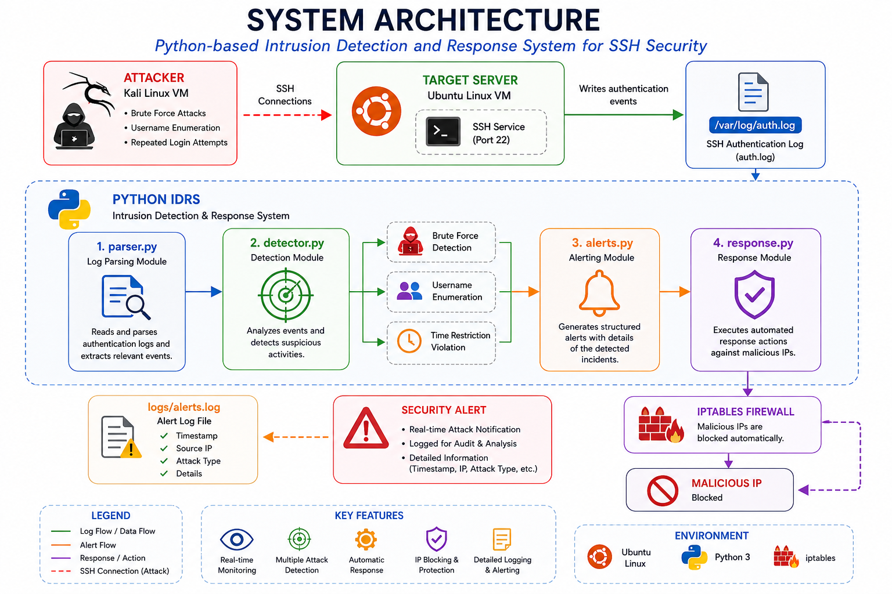

## Features

- Continuous monitoring of SSH authentication logs
- Brute-force detection based on failed authentication attempts
- Username enumeration detection based on distinct invalid usernames
- Time-based SSH access restriction
- Timestamped security alerts
- Automatic IP blocking using `iptables`
- Automatic removal of temporary firewall blocks
- Centralized configuration
- Modular Python implementation

## Detection Mechanisms

### Brute Force Detection

The system monitors failed authentication attempts against valid usernames for each source IP.

The default threshold is **5 failed attempts**.

When the threshold is reached, a brute-force alert is generated and the source IP is blocked.

### Username Enumeration Detection

The system tracks distinct invalid usernames attempted by each source IP.

The default threshold is **3 distinct usernames**.

A Python `set` is used so that repeatedly attempting the same invalid username does not increase the number of distinct usernames.

### Time-Based Access Restriction

SSH authentication attempts are allowed during the configured period:

**08:00 – 18:00**

An authentication attempt outside this period immediately generates an alert and triggers IP blocking.

## Module Responsibilities

| Module | Responsibility |
|---|---|
| `config.py` | Stores configurable thresholds, access hours, log paths, and block duration |
| `parser.py` | Reads `/var/log/auth.log` and extracts relevant SSH authentication events |
| `detector.py` | Analyzes authentication events and detects suspicious activity |
| `alerts.py` | Generates and records timestamped security alerts |
| `response.py` | Adds and removes `iptables` rules to temporarily block source IPs |
| `main.py` | Coordinates the modules and continuously monitors for new authentication events |

## Configuration

The main parameters are centralized in `config.py`.

    FAILED_ATTEMPT_THRESHOLD = 5
    USERNAME_ENUMERATION_THRESHOLD = 3
    BLOCK_DURATION = 120

    SSH_START_HOUR = 8
    SSH_END_HOUR = 18

These values can be modified without changing the detection logic.

## Requirements

- Ubuntu Linux
- Python 3
- OpenSSH server
- `iptables`
- Kali Linux or another machine capable of generating SSH authentication attempts
- An isolated network for testing

The project uses only Python standard-library modules and does not require external Python packages.

## Running the System

The system is executed on the protected Ubuntu server:

    sudo python3 main.py

The program monitors:

    /var/log/auth.log

and checks for new authentication events every two seconds.

When a detection condition is triggered, an alert is displayed in the terminal and recorded in:

    logs/alerts.log

The source IP is then temporarily blocked using `iptables`.

## Testing

The system was tested in an isolated virtual environment using Kali Linux as the attacker machine and Ubuntu Linux as the protected SSH server.

### 1. Normal Authentication

A legitimate SSH connection was performed using valid credentials during the authorized period.

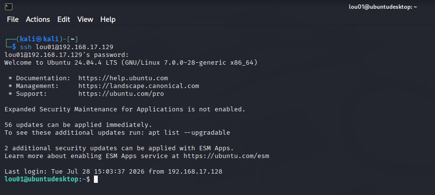

The connection was established successfully without generating a security alert.

### 2. SSH Brute Force

Five consecutive failed authentication attempts were performed against a valid username.

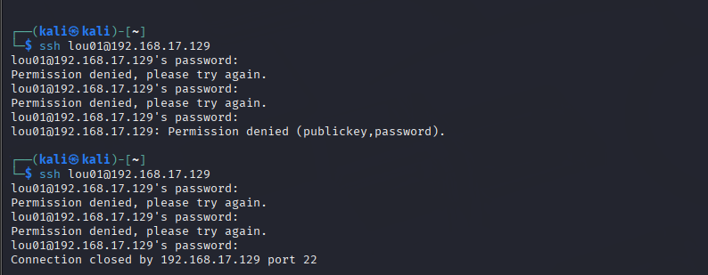

The system detected the attack and generated a brute-force alert containing the source IP, username, timestamp, and number of failed attempts.

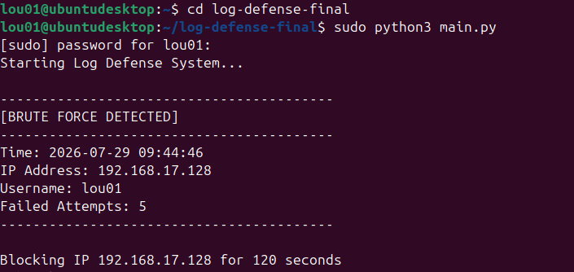

The attacking IP address was then blocked by inserting a `DROP` rule into the `INPUT` chain of `iptables`.

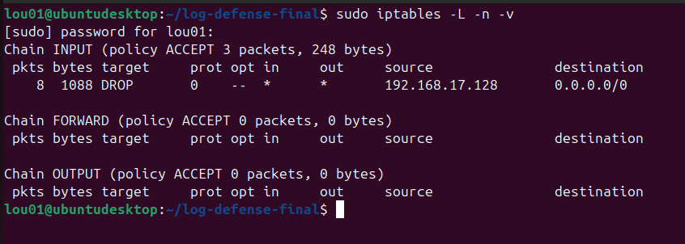

### 3. Username Enumeration

Three different invalid usernames were attempted from the same source IP.

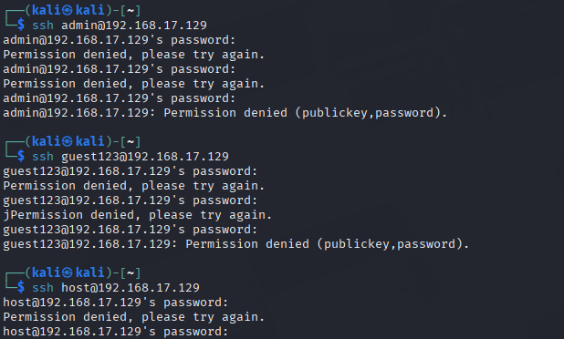

After the configured threshold was reached, the system generated a username enumeration alert containing the attempted usernames and their total number.

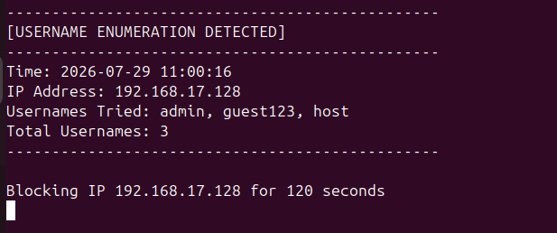

The source IP address was subsequently blocked using `iptables`.

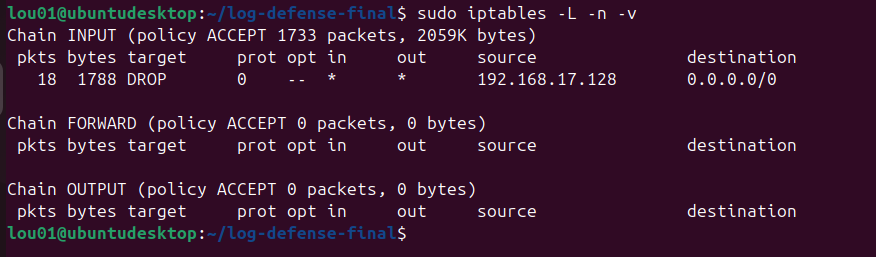

### 4. Time-Based SSH Access Restriction

An SSH authentication attempt was generated outside the configured authorized access period.

The system generated a time-based access violation alert.

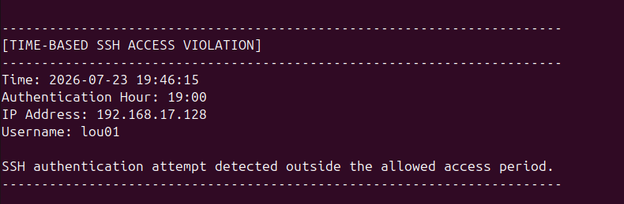

The source IP address was blocked immediately using `iptables`.

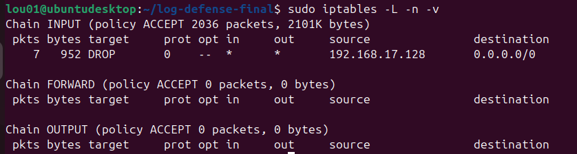

### 5. SSH Authentication Log

The system relies on SSH authentication events recorded in `/var/log/auth.log`. The parser extracts information such as the authentication type, username, timestamp, and source IP address from relevant `sshd` entries.

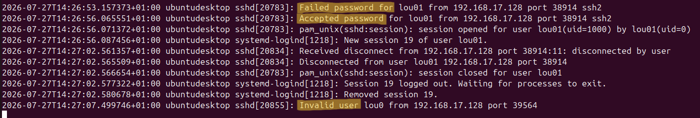

### 6. Automatic IP Unblocking

Blocked IP addresses are automatically unblocked after the configured 120-second duration.

The `iptables` rule is initially present while the IP address is blocked.

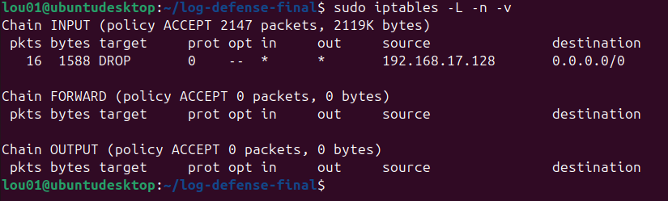

After the blocking period expires, the corresponding `DROP` rule is automatically removed.

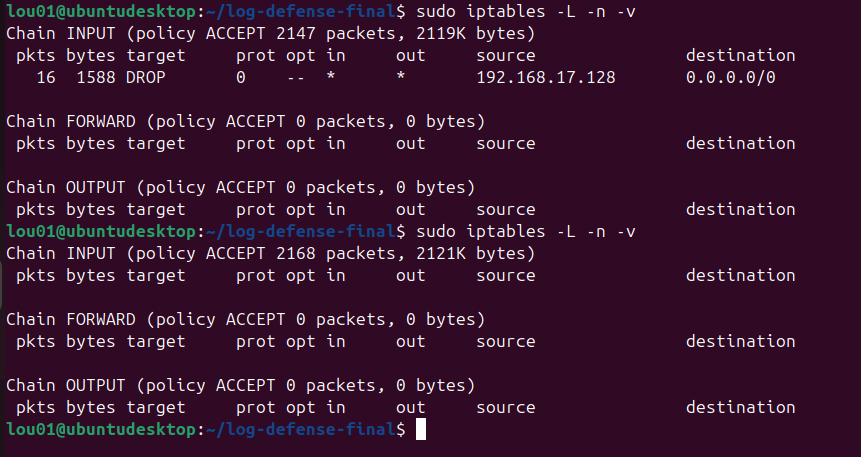

